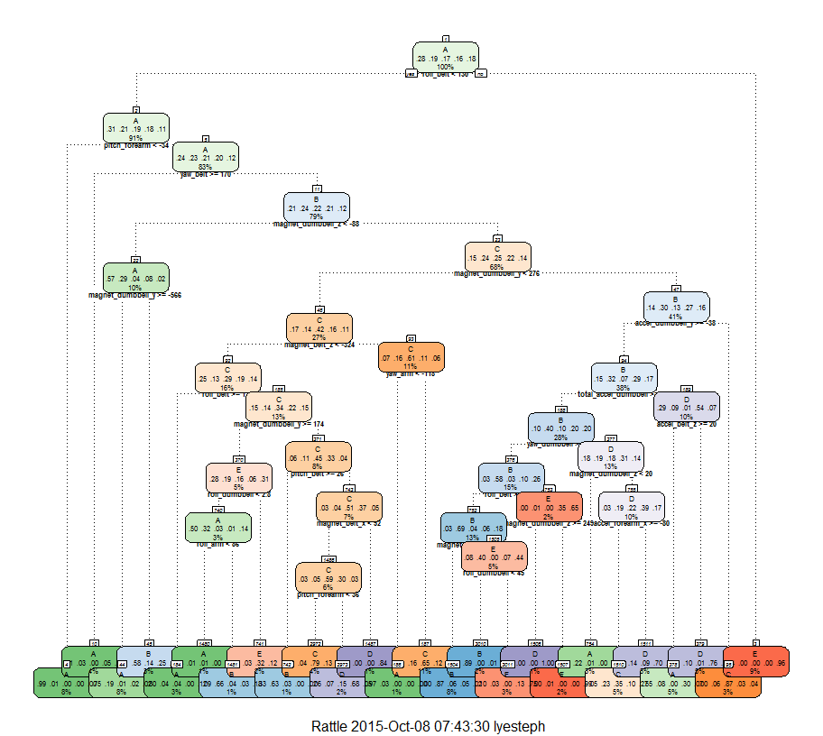

# TITLE: Practical Machine Learning - Prediction Assignment
Author: Stephen Lye  
Date: 8 October 2015  

## OVERVIEW

The purpose of this project is build a machine learning algorithm to predict activity quality from activity monitors.

Using devices such as Jawbone Up, Nike FuelBand, and Fitbit it is now possible to collect a large amount of data about personal activity relatively inexpensively. These type of devices are part of the quantified self movement - a group of enthusiasts who take measurements about themselves regularly to improve their health, to find patterns in their behavior, or because they are tech geeks. One thing that people regularly do is quantify how much of a particular activity they do, but they rarely quantify how well they do it. In this project, your goal will be to use data from accelerometers on the belt, forearm, arm, and dumbell of 6 participants. They were asked to perform barbell lifts correctly and incorrectly in 5 different ways.

<font color = 'Red'>
Note: The data for this project comes from this source: http://groupware.les.inf.puc-rio.br/har
</font>

### STEP 1 - INITIAL SETUP AND LOAD LIBRARIES

```r
# Clear Workspace
rm(list=ls())

# Load Libraries
library(caret)
library(rpart)
library(rpart.plot)
library(rattle)
library(randomForest)
```

### STEP 2 - LOAD DATA

```r
# Download source data files
SrcURL <- 'https://d396qusza40orc.cloudfront.net/predmachlearn/pml-training.csv'
DestFile <- 'pml-training.csv'
if(!file.exists(DestFile)) {download.file(url = SrcURL, destfile = DestFile, cacheOK = TRUE)}

# Read Data
if(!exists('df_Train')) {df_Train <- read.csv(DestFile, header = TRUE, sep = ',')}
```

Show the number of **Rows** and **Columns** of data

Data Rows = 19,622  
Data Columns = 160

Show a **Sample** of the data

```r
head(df_Train, 2L)
```

```
##   X user_name raw_timestamp_part_1 raw_timestamp_part_2   cvtd_timestamp
## 1 1  carlitos           1323084231               788290 05/12/2011 11:23
## 2 2  carlitos           1323084231               808298 05/12/2011 11:23
##   new_window num_window roll_belt pitch_belt yaw_belt total_accel_belt
## 1         no         11      1.41       8.07    -94.4                3
## 2         no         11      1.41       8.07    -94.4                3
##   kurtosis_roll_belt kurtosis_picth_belt kurtosis_yaw_belt
## 1                                                         
## 2                                                         
##   skewness_roll_belt skewness_roll_belt.1 skewness_yaw_belt max_roll_belt
## 1                                                                      NA
## 2                                                                      NA
##   max_picth_belt max_yaw_belt min_roll_belt min_pitch_belt min_yaw_belt
## 1             NA                         NA             NA             
## 2             NA                         NA             NA             
##   amplitude_roll_belt amplitude_pitch_belt amplitude_yaw_belt
## 1                  NA                   NA                   
## 2                  NA                   NA                   
##   var_total_accel_belt avg_roll_belt stddev_roll_belt var_roll_belt
## 1                   NA            NA               NA            NA
## 2                   NA            NA               NA            NA
##   avg_pitch_belt stddev_pitch_belt var_pitch_belt avg_yaw_belt
## 1             NA                NA             NA           NA
## 2             NA                NA             NA           NA
##   stddev_yaw_belt var_yaw_belt gyros_belt_x gyros_belt_y gyros_belt_z
## 1              NA           NA         0.00            0        -0.02
## 2              NA           NA         0.02            0        -0.02
##   accel_belt_x accel_belt_y accel_belt_z magnet_belt_x magnet_belt_y
## 1          -21            4           22            -3           599
## 2          -22            4           22            -7           608
##   magnet_belt_z roll_arm pitch_arm yaw_arm total_accel_arm var_accel_arm
## 1          -313     -128      22.5    -161              34            NA
## 2          -311     -128      22.5    -161              34            NA
##   avg_roll_arm stddev_roll_arm var_roll_arm avg_pitch_arm stddev_pitch_arm
## 1           NA              NA           NA            NA               NA
## 2           NA              NA           NA            NA               NA
##   var_pitch_arm avg_yaw_arm stddev_yaw_arm var_yaw_arm gyros_arm_x
## 1            NA          NA             NA          NA        0.00
## 2            NA          NA             NA          NA        0.02
##   gyros_arm_y gyros_arm_z accel_arm_x accel_arm_y accel_arm_z magnet_arm_x
## 1        0.00       -0.02        -288         109        -123         -368
## 2       -0.02       -0.02        -290         110        -125         -369
##   magnet_arm_y magnet_arm_z kurtosis_roll_arm kurtosis_picth_arm
## 1          337          516                                     
## 2          337          513                                     
##   kurtosis_yaw_arm skewness_roll_arm skewness_pitch_arm skewness_yaw_arm
## 1                                                                       
## 2                                                                       
##   max_roll_arm max_picth_arm max_yaw_arm min_roll_arm min_pitch_arm
## 1           NA            NA          NA           NA            NA
## 2           NA            NA          NA           NA            NA
##   min_yaw_arm amplitude_roll_arm amplitude_pitch_arm amplitude_yaw_arm
## 1          NA                 NA                  NA                NA
## 2          NA                 NA                  NA                NA
##   roll_dumbbell pitch_dumbbell yaw_dumbbell kurtosis_roll_dumbbell
## 1      13.05217      -70.49400    -84.87394                       
## 2      13.13074      -70.63751    -84.71065                       
##   kurtosis_picth_dumbbell kurtosis_yaw_dumbbell skewness_roll_dumbbell
## 1                                                                     
## 2                                                                     
##   skewness_pitch_dumbbell skewness_yaw_dumbbell max_roll_dumbbell
## 1                                                              NA
## 2                                                              NA
##   max_picth_dumbbell max_yaw_dumbbell min_roll_dumbbell min_pitch_dumbbell
## 1                 NA                                 NA                 NA
## 2                 NA                                 NA                 NA
##   min_yaw_dumbbell amplitude_roll_dumbbell amplitude_pitch_dumbbell
## 1                                       NA                       NA
## 2                                       NA                       NA
##   amplitude_yaw_dumbbell total_accel_dumbbell var_accel_dumbbell
## 1                                          37                 NA
## 2                                          37                 NA
##   avg_roll_dumbbell stddev_roll_dumbbell var_roll_dumbbell
## 1                NA                   NA                NA
## 2                NA                   NA                NA
##   avg_pitch_dumbbell stddev_pitch_dumbbell var_pitch_dumbbell
## 1                 NA                    NA                 NA
## 2                 NA                    NA                 NA
##   avg_yaw_dumbbell stddev_yaw_dumbbell var_yaw_dumbbell gyros_dumbbell_x
## 1               NA                  NA               NA                0
## 2               NA                  NA               NA                0
##   gyros_dumbbell_y gyros_dumbbell_z accel_dumbbell_x accel_dumbbell_y
## 1            -0.02                0             -234               47
## 2            -0.02                0             -233               47
##   accel_dumbbell_z magnet_dumbbell_x magnet_dumbbell_y magnet_dumbbell_z
## 1             -271              -559               293               -65
## 2             -269              -555               296               -64
##   roll_forearm pitch_forearm yaw_forearm kurtosis_roll_forearm
## 1         28.4         -63.9        -153                      
## 2         28.3         -63.9        -153                      
##   kurtosis_picth_forearm kurtosis_yaw_forearm skewness_roll_forearm
## 1                                                                  
## 2                                                                  
##   skewness_pitch_forearm skewness_yaw_forearm max_roll_forearm
## 1                                                           NA
## 2                                                           NA
##   max_picth_forearm max_yaw_forearm min_roll_forearm min_pitch_forearm
## 1                NA                               NA                NA
## 2                NA                               NA                NA
##   min_yaw_forearm amplitude_roll_forearm amplitude_pitch_forearm
## 1                                     NA                      NA
## 2                                     NA                      NA
##   amplitude_yaw_forearm total_accel_forearm var_accel_forearm
## 1                                        36                NA
## 2                                        36                NA
##   avg_roll_forearm stddev_roll_forearm var_roll_forearm avg_pitch_forearm
## 1               NA                  NA               NA                NA
## 2               NA                  NA               NA                NA
##   stddev_pitch_forearm var_pitch_forearm avg_yaw_forearm
## 1                   NA                NA              NA
## 2                   NA                NA              NA
##   stddev_yaw_forearm var_yaw_forearm gyros_forearm_x gyros_forearm_y
## 1                 NA              NA            0.03               0
## 2                 NA              NA            0.02               0
##   gyros_forearm_z accel_forearm_x accel_forearm_y accel_forearm_z
## 1           -0.02             192             203            -215
## 2           -0.02             192             203            -216
##   magnet_forearm_x magnet_forearm_y magnet_forearm_z classe
## 1              -17              654              476      A
## 2              -18              661              473      A
```

Show the **column names** of the data

```r
names(df_Train)
```

```
##   [1] "X"                        "user_name"               
##   [3] "raw_timestamp_part_1"     "raw_timestamp_part_2"    
##   [5] "cvtd_timestamp"           "new_window"              
##   [7] "num_window"               "roll_belt"               
##   [9] "pitch_belt"               "yaw_belt"                
##  [11] "total_accel_belt"         "kurtosis_roll_belt"      
##  [13] "kurtosis_picth_belt"      "kurtosis_yaw_belt"       
##  [15] "skewness_roll_belt"       "skewness_roll_belt.1"    
##  [17] "skewness_yaw_belt"        "max_roll_belt"           
##  [19] "max_picth_belt"           "max_yaw_belt"            
##  [21] "min_roll_belt"            "min_pitch_belt"          
##  [23] "min_yaw_belt"             "amplitude_roll_belt"     
##  [25] "amplitude_pitch_belt"     "amplitude_yaw_belt"      
##  [27] "var_total_accel_belt"     "avg_roll_belt"           
##  [29] "stddev_roll_belt"         "var_roll_belt"           
##  [31] "avg_pitch_belt"           "stddev_pitch_belt"       
##  [33] "var_pitch_belt"           "avg_yaw_belt"            
##  [35] "stddev_yaw_belt"          "var_yaw_belt"            
##  [37] "gyros_belt_x"             "gyros_belt_y"            
##  [39] "gyros_belt_z"             "accel_belt_x"            
##  [41] "accel_belt_y"             "accel_belt_z"            
##  [43] "magnet_belt_x"            "magnet_belt_y"           
##  [45] "magnet_belt_z"            "roll_arm"                
##  [47] "pitch_arm"                "yaw_arm"                 
##  [49] "total_accel_arm"          "var_accel_arm"           
##  [51] "avg_roll_arm"             "stddev_roll_arm"         
##  [53] "var_roll_arm"             "avg_pitch_arm"           
##  [55] "stddev_pitch_arm"         "var_pitch_arm"           
##  [57] "avg_yaw_arm"              "stddev_yaw_arm"          
##  [59] "var_yaw_arm"              "gyros_arm_x"             
##  [61] "gyros_arm_y"              "gyros_arm_z"             
##  [63] "accel_arm_x"              "accel_arm_y"             
##  [65] "accel_arm_z"              "magnet_arm_x"            
##  [67] "magnet_arm_y"             "magnet_arm_z"            
##  [69] "kurtosis_roll_arm"        "kurtosis_picth_arm"      
##  [71] "kurtosis_yaw_arm"         "skewness_roll_arm"       
##  [73] "skewness_pitch_arm"       "skewness_yaw_arm"        
##  [75] "max_roll_arm"             "max_picth_arm"           
##  [77] "max_yaw_arm"              "min_roll_arm"            
##  [79] "min_pitch_arm"            "min_yaw_arm"             
##  [81] "amplitude_roll_arm"       "amplitude_pitch_arm"     
##  [83] "amplitude_yaw_arm"        "roll_dumbbell"           
##  [85] "pitch_dumbbell"           "yaw_dumbbell"            
##  [87] "kurtosis_roll_dumbbell"   "kurtosis_picth_dumbbell" 
##  [89] "kurtosis_yaw_dumbbell"    "skewness_roll_dumbbell"  
##  [91] "skewness_pitch_dumbbell"  "skewness_yaw_dumbbell"   
##  [93] "max_roll_dumbbell"        "max_picth_dumbbell"      
##  [95] "max_yaw_dumbbell"         "min_roll_dumbbell"       
##  [97] "min_pitch_dumbbell"       "min_yaw_dumbbell"        
##  [99] "amplitude_roll_dumbbell"  "amplitude_pitch_dumbbell"
## [101] "amplitude_yaw_dumbbell"   "total_accel_dumbbell"    
## [103] "var_accel_dumbbell"       "avg_roll_dumbbell"       
## [105] "stddev_roll_dumbbell"     "var_roll_dumbbell"       
## [107] "avg_pitch_dumbbell"       "stddev_pitch_dumbbell"   
## [109] "var_pitch_dumbbell"       "avg_yaw_dumbbell"        
## [111] "stddev_yaw_dumbbell"      "var_yaw_dumbbell"        
## [113] "gyros_dumbbell_x"         "gyros_dumbbell_y"        
## [115] "gyros_dumbbell_z"         "accel_dumbbell_x"        
## [117] "accel_dumbbell_y"         "accel_dumbbell_z"        
## [119] "magnet_dumbbell_x"        "magnet_dumbbell_y"       
## [121] "magnet_dumbbell_z"        "roll_forearm"            
## [123] "pitch_forearm"            "yaw_forearm"             
## [125] "kurtosis_roll_forearm"    "kurtosis_picth_forearm"  
## [127] "kurtosis_yaw_forearm"     "skewness_roll_forearm"   
## [129] "skewness_pitch_forearm"   "skewness_yaw_forearm"    
## [131] "max_roll_forearm"         "max_picth_forearm"       
## [133] "max_yaw_forearm"          "min_roll_forearm"        
## [135] "min_pitch_forearm"        "min_yaw_forearm"         
## [137] "amplitude_roll_forearm"   "amplitude_pitch_forearm" 
## [139] "amplitude_yaw_forearm"    "total_accel_forearm"     
## [141] "var_accel_forearm"        "avg_roll_forearm"        
## [143] "stddev_roll_forearm"      "var_roll_forearm"        
## [145] "avg_pitch_forearm"        "stddev_pitch_forearm"    
## [147] "var_pitch_forearm"        "avg_yaw_forearm"         
## [149] "stddev_yaw_forearm"       "var_yaw_forearm"         
## [151] "gyros_forearm_x"          "gyros_forearm_y"         
## [153] "gyros_forearm_z"          "accel_forearm_x"         
## [155] "accel_forearm_y"          "accel_forearm_z"         
## [157] "magnet_forearm_x"         "magnet_forearm_y"        
## [159] "magnet_forearm_z"         "classe"
```

### STEP 3 - CLEAN THE DATA
Before we start building the models for prediction, we must first clean up the raw data by removing columns that are not required for analysis, removing columns with mostly NA data and removing data with Near Zero Variance (NZV).

REMOVE UNNECESSARY COLUMNS 1 - 7 AS IT IS NOT MEANINGFUL FOR ANALYSIS

```r
df_Train <- df_Train[, -c(1:7)]
```

Show the number of **Rows** and **Columns** of data **after removing the unnecessary columns**

Data Rows = 19,622  
Data Columns = 153

REMOVE COLUMNS WITH 70% NA VALUES

```r
Cutoff_Level <- nrow(df_Train) * 0.7
df_Train <- df_Train[, colSums(is.na(df_Train)) <= Cutoff_Level]
```

Show the number of **Rows** and **Columns** of data **after removing the columns with at least 70% of NA values**

Data Rows = 19,622  
Data Columns = 86

REMOVE COLUMNS WITH NEAR ZERO VARIANCE (NZV)

```r
Train_NZV <- nearZeroVar(df_Train, saveMetrics = TRUE)
Cols2Keep <- rownames(Train_NZV[Train_NZV$nzv == FALSE, ])
df_Train <- df_Train[Cols2Keep]
```

Show the number of **Rows** and **Columns** of data **after removing the columns with Near Zero Variance (NZV)**

Data Rows = 19,622  
Data Columns = 53

### STEP 4 - SPLIT DATA INTO 2 SETS FOR ANALYSIS
After performing the data cleaning, we now split the original data set into 2 - the 1st set is for data sampling and the 2nd set is for cross validation.

SPLIT THE ORIGINAL DATA SET INTO 2 SEPARATE DATA SETS - ONE WITH 60% OF THE ORIGINAL DATA AND THE OTHER WITH THE REMAINING 40%.

```r
InclData <- createDataPartition(y = df_Train$classe, p = 0.6, list = FALSE)
df_Train_60 <- df_Train[InclData, ]
df_Train_40 <- df_Train[-InclData, ]
```

REMOVE ORIGINAL DATA SET AS IT IS NO LONGER REQUIRED

```r
rm(df_Train)
```

Show the number of **Rows** and **Columns** of data from **Data Set 1 (df_Train_60) which has 60% of the data from the original data set**

Data Rows = 11,776  
Data Columns = 53

Show the number of **Rows** and **Columns** of data from **Data Set 2 (df_Train_40) which has 40% of the data from the original data set**

Data Rows = 7,846  
Data Columns = 53

### STEP 5 - PERFORM MACHINE LEARNING ON DECISION TREE
After our data sets have been prepared, we now proceed to **build the appropriate prediction models using Machine Learning**. We first start with a **Decision Tree** model.


```r
# Set seed
set.seed(1000)

# Use ML Algo for prediction - Decision Tree
PredictionModel1 <- rpart(classe ~ ., data = df_Train_60, method = 'class')

# Perform prediction
DT_Prediction <- predict(PredictionModel1, df_Train_40, type = 'class')
```

### STEP 6 - VIEW DECISION TREE
We **view the contents of the Decision Tree** as shown below:-

```r
print(PredictionModel1)
```

```
## n= 11776 
## 
## node), split, n, loss, yval, (yprob)
##       * denotes terminal node
## 
##    1) root 11776 8428 A (0.28 0.19 0.17 0.16 0.18)  
##      2) roll_belt< 129.5 10709 7399 A (0.31 0.21 0.19 0.18 0.11)  
##        4) pitch_forearm< -33.6 976    9 A (0.99 0.0092 0 0 0) *
##        5) pitch_forearm>=-33.6 9733 7390 A (0.24 0.23 0.21 0.2 0.12)  
##         10) yaw_belt>=169.5 471   43 A (0.91 0.034 0 0.051 0.0064) *
##         11) yaw_belt< 169.5 9262 7008 B (0.21 0.24 0.22 0.21 0.12)  
##           22) magnet_dumbbell_z< -88.5 1211  520 A (0.57 0.29 0.041 0.078 0.021)  
##             44) magnet_dumbbell_y>=-566.5 915  226 A (0.75 0.19 0.0087 0.024 0.021) *
##             45) magnet_dumbbell_y< -566.5 296  123 B (0.0068 0.58 0.14 0.25 0.02) *
##           23) magnet_dumbbell_z>=-88.5 8051 6047 C (0.15 0.24 0.25 0.22 0.14)  
##             46) magnet_dumbbell_y< 275.5 3198 1844 C (0.17 0.14 0.42 0.16 0.11)  
##               92) magnet_belt_z< -324.5 1844 1311 C (0.25 0.13 0.29 0.19 0.14)  
##                184) roll_belt>=123.5 301   60 A (0.8 0.043 0.037 0 0.12) *
##                185) roll_belt< 123.5 1543 1021 C (0.15 0.14 0.34 0.22 0.15)  
##                  370) magnet_dumbbell_y>=173.5 601  412 E (0.28 0.19 0.16 0.062 0.31)  
##                    740) roll_dumbbell< 2.828694 328  163 A (0.5 0.32 0.027 0.012 0.14)  
##                     1480) roll_arm< 86.45 171   20 A (0.88 0.012 0.012 0 0.094) *
##                     1481) roll_arm>=86.45 157   54 B (0.089 0.66 0.045 0.025 0.18) *
##                    741) roll_dumbbell>=2.828694 273  129 E (0.0037 0.026 0.32 0.12 0.53) *
##                  371) magnet_dumbbell_y< 173.5 942  517 C (0.062 0.11 0.45 0.33 0.044)  
##                    742) pitch_belt>=26.05 113   42 B (0.33 0.63 0.027 0 0.018) *
##                    743) pitch_belt< 26.05 829  407 C (0.025 0.045 0.51 0.37 0.047)  
##                     1486) magnet_belt_x< 51.5 711  289 C (0.028 0.052 0.59 0.3 0.03)  
##                       2972) pitch_forearm< 36.35 494  105 C (0.016 0.045 0.79 0.13 0.022) *
##                       2973) pitch_forearm>=36.35 217   70 D (0.055 0.069 0.15 0.68 0.046) *
##                     1487) magnet_belt_x>=51.5 118   19 D (0.0085 0 0 0.84 0.15) *
##               93) magnet_belt_z>=-324.5 1354  533 C (0.069 0.16 0.61 0.11 0.056)  
##                186) yaw_arm< -118 90    3 A (0.97 0.033 0 0 0) *
##                187) yaw_arm>=-118 1264  443 C (0.0055 0.16 0.65 0.12 0.06) *
##             47) magnet_dumbbell_y>=275.5 4853 3393 B (0.14 0.3 0.13 0.27 0.16)  
##               94) accel_dumbbell_y>=-38.5 4489 3051 B (0.15 0.32 0.074 0.29 0.17)  
##                188) total_accel_dumbbell>=5.5 3302 1975 B (0.099 0.4 0.099 0.2 0.2)  
##                  376) yaw_dumbbell>=-62.20565 1757  730 B (0.026 0.58 0.03 0.1 0.26)  
##                    752) roll_belt>=-0.6 1483  458 B (0.03 0.69 0.036 0.058 0.18)  
##                     1504) magnet_belt_y>=587.5 907  115 B (0.0011 0.87 0.058 0.047 0.02) *
##                     1505) magnet_belt_y< 587.5 576  320 E (0.076 0.4 0 0.075 0.44)  
##                       3010) roll_dumbbell< 45.44952 251   28 B (0.052 0.89 0 0.008 0.052) *
##                       3011) roll_dumbbell>=45.44952 325   82 E (0.095 0.031 0 0.13 0.75) *
##                    753) roll_belt< -0.6 274   97 E (0 0.0073 0 0.35 0.65)  
##                     1506) magnet_dumbbell_z>=249 95    0 D (0 0 0 1 0) *
##                     1507) magnet_dumbbell_z< 249 179    2 E (0 0.011 0 0 0.99) *
##                  377) yaw_dumbbell< -62.20565 1545 1070 D (0.18 0.19 0.18 0.31 0.14)  
##                    754) magnet_dumbbell_z< 20.5 326   79 A (0.76 0.22 0.0061 0 0.012) *
##                    755) magnet_dumbbell_z>=20.5 1219  744 D (0.028 0.19 0.22 0.39 0.17)  
##                     1510) accel_forearm_x>=-80.5 631  410 C (0.054 0.23 0.35 0.097 0.27) *
##                     1511) accel_forearm_x< -80.5 588  174 D (0 0.14 0.087 0.7 0.065) *
##                189) total_accel_dumbbell< 5.5 1187  541 D (0.29 0.094 0.0059 0.54 0.071)  
##                  378) accel_belt_z>=20.5 559  251 A (0.55 0.084 0 0.3 0.068) *
##                  379) accel_belt_z< 20.5 628  148 D (0.049 0.1 0.011 0.76 0.073) *
##               95) accel_dumbbell_y< -38.5 364   48 C (0 0.06 0.87 0.027 0.044) *
##      3) roll_belt>=129.5 1067   38 E (0.036 0 0 0 0.96) *
```

### STEP 7 - VISUALISE DECISION TREE
We **visualise the Decision Tree** by the plot below:-

```r
fancyRpartPlot(PredictionModel1, cex = .5, under.cex = 1, shadow.offset = 0)
```

 

### STEP 8 - SHOW DECISION TREE RESULTS
We now show the results of the **Decision Tree** prediction model by using the **Confusion Matrix**.


```r
Results <- confusionMatrix(DT_Prediction, df_Train_40$classe)
Results
```

```
## Confusion Matrix and Statistics
## 
##           Reference
## Prediction    A    B    C    D    E
##          A 2056  233   26  147   72
##          B   56  859   95   58   38
##          C   32  288 1114  216  169
##          D   29  121   72  813   89
##          E   59   17   61   52 1074
## 
## Overall Statistics
##                                           
##                Accuracy : 0.754           
##                  95% CI : (0.7443, 0.7635)
##     No Information Rate : 0.2845          
##     P-Value [Acc > NIR] : < 2.2e-16       
##                                           
##                   Kappa : 0.6876          
##  Mcnemar's Test P-Value : < 2.2e-16       
## 
## Statistics by Class:
## 
##                      Class: A Class: B Class: C Class: D Class: E
## Sensitivity            0.9211   0.5659   0.8143   0.6322   0.7448
## Specificity            0.9149   0.9610   0.8912   0.9526   0.9705
## Pos Pred Value         0.8114   0.7767   0.6124   0.7233   0.8504
## Neg Pred Value         0.9669   0.9022   0.9579   0.9296   0.9441
## Prevalence             0.2845   0.1935   0.1744   0.1639   0.1838
## Detection Rate         0.2620   0.1095   0.1420   0.1036   0.1369
## Detection Prevalence   0.3230   0.1410   0.2318   0.1433   0.1610
## Balanced Accuracy      0.9180   0.7634   0.8527   0.7924   0.8576
```


The result shows that the accuracy of this model is only **0.754** ie. **75.4%** accurate. This is **not good enough**.

### STEP 9 - PERFORM MACHINE LEARNING ON RANDOM FOREST
As the previous prediction model didn't provide us with a high level of accuracy, we will now proceed to **build a better prediction model** by using the **Random Forest** method.


```r
# Use ML Algo for prediction - Random Forest
PredictionModel2 <- randomForest(classe ~. , data = df_Train_60)

# Perform prediction
RF_Prediction <- predict(PredictionModel2, df_Train_40, type = 'class')
```

### STEP 10 - SHOW RANDOM FOREST RESULTS
We now show the results of the **Random Forest** prediction model by using the **Confusion Matrix**.


```r
Results <- confusionMatrix(RF_Prediction, df_Train_40$classe)
Results
```

```
## Confusion Matrix and Statistics
## 
##           Reference
## Prediction    A    B    C    D    E
##          A 2230   14    0    0    0
##          B    2 1501   18    0    0
##          C    0    3 1348   11    6
##          D    0    0    2 1275    8
##          E    0    0    0    0 1428
## 
## Overall Statistics
##                                           
##                Accuracy : 0.9918          
##                  95% CI : (0.9896, 0.9937)
##     No Information Rate : 0.2845          
##     P-Value [Acc > NIR] : < 2.2e-16       
##                                           
##                   Kappa : 0.9897          
##  Mcnemar's Test P-Value : NA              
## 
## Statistics by Class:
## 
##                      Class: A Class: B Class: C Class: D Class: E
## Sensitivity            0.9991   0.9888   0.9854   0.9914   0.9903
## Specificity            0.9975   0.9968   0.9969   0.9985   1.0000
## Pos Pred Value         0.9938   0.9869   0.9854   0.9922   1.0000
## Neg Pred Value         0.9996   0.9973   0.9969   0.9983   0.9978
## Prevalence             0.2845   0.1935   0.1744   0.1639   0.1838
## Detection Rate         0.2842   0.1913   0.1718   0.1625   0.1820
## Detection Prevalence   0.2860   0.1939   0.1744   0.1638   0.1820
## Balanced Accuracy      0.9983   0.9928   0.9911   0.9950   0.9951
```


The result shows that the accuracy of this model is **0.9918** ie. **99.18%** accurate. This is **good enough**.

### STEP 11 - SHOW EXPECTED OUT OF SAMPLE ERROR
Out of Sample Error is calculated as `1 - Accuracy`.

For the **1st Prediction Model** using **Decision Tree**,  
the **Accuracy** = **0.754**  
and the **Out of Sample Error** = 1 - 0.754 = **0.246**

For the **2nd Prediction Model** using **Random Forest**,  
the **Accuracy** = **0.9918**  
and the **Out of Sample Error** = 1 - 0.9918 = **0.0082**

## CONCLUSION

Based on the results of the **Confusion Matrix** and **Out of Sample Error** on both prediction models, it shows that the **Random Forest model is far more accurate and more reliable** than the **Decision Tree** model.

Since the **Random Forest model is the most accurate model** that we can derive thus far and the **Out of Sample Error is very small**, we will use it for Part 2 of the assignment to predict the outcome from a set of Test Data.

## ASSIGNMENT PART 2

### PART 2 STEP 1 - LOAD TEST DATA

```r
SrcURL <- 'https://d396qusza40orc.cloudfront.net/predmachlearn/pml-testing.csv'
DestFile <- 'pml-testing.csv'

if(!exists('df_Test')) {df_Test <- read.csv(DestFile, header = TRUE, sep = ',')}
```

Show the number of **Rows** and **Columns** of data

Data Rows = 20  
Data Columns = 160

### PART 2 STEP 2 - CONVERT TEST DATA TO HAVE THE SAME COLUMNS AS THE TRAINING DATA

```r
# Remove last column (classe) as it is not required
Cols2Keep <- colnames(df_Train_60[, -ncol(df_Train_60)])
df_Test <- df_Test[Cols2Keep]
```

Show the number of **Rows** and **Columns** of data **after converting the columns in the test data to be the same as the training data**

Data Rows = 20  
Data Columns = 52

### PART 2 STEP 3 - DEFINE FUNCTION TO GENERATE RESULTS FILES FOR SUBMISSION

```r
pml_write_files = function(x) {
  n = length(x)
  for(i in 1:n) {
      filename = paste0("./Part2_Results/problem_id_",i,".txt")
      write.table(x[i],file=filename,quote=FALSE,row.names=FALSE,col.names=FALSE)
  }
}
```

### PART 2 STEP 4 - PERFORM PREDICTION - USE **RANDOM FOREST** MODEL AS IT IS THE BEST

```r
RF_Prediction_Test <- predict(PredictionModel2, df_Test, type = 'class')
```

### PART 2 STEP 5 - SHOW THE RESULTS OF THE PREDICTION

```r
RF_Prediction_Test
```

```
##  1  2  3  4  5  6  7  8  9 10 11 12 13 14 15 16 17 18 19 20 
##  B  A  B  A  A  E  D  B  A  A  B  C  B  A  E  E  A  B  B  B 
## Levels: A B C D E
```

### PART 2 STEP 6 - OUTPUT THE RESULTS TO TEXT FILES

```r
pml_write_files(RF_Prediction_Test)
```

### ~ END ~
